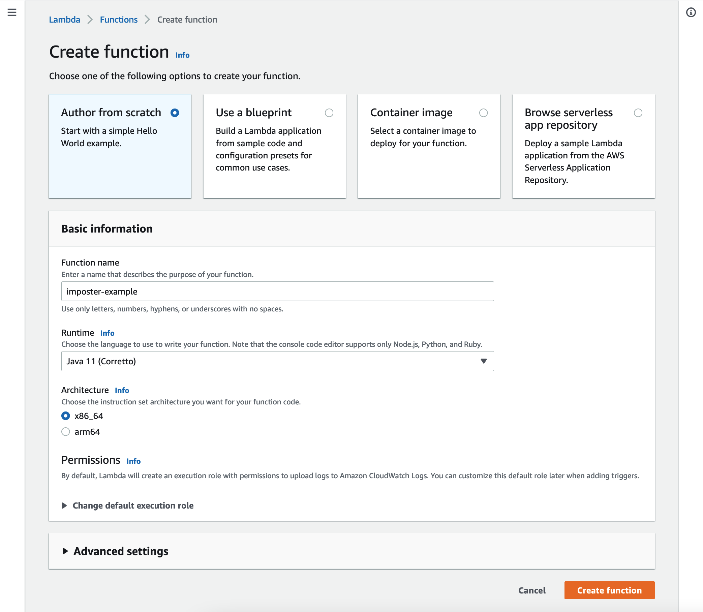
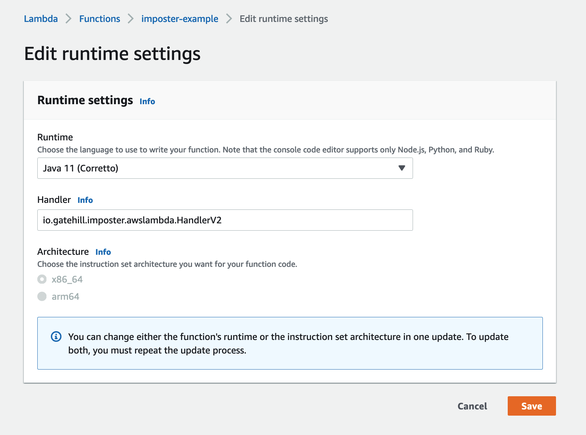

# Running Imposter in AWS Lambda

There are many ways to run Imposter. This section describes how to run it as a Lambda function in AWS.

---
### Other ways to run Imposter

#### Standalone mock server

- Using the command line client - see [Imposter CLI](./run_imposter_cli.md)
- As a Docker container - see [Imposter Docker container](./run_imposter_docker.md)
- As a JAR file on the JVM - see [Imposter JAR file](./run_imposter_jar.md)

#### Embedded in tests

- Embedded within your **Java/Kotlin/Scala/JVM** unit tests - see [JVM bindings](./embed_jvm.md) 
- Embedded within your **JavaScript/Node.js** unit tests - see [JavaScript bindings](https://github.com/gatehill/imposter-js)

---

## AWS Lambda Features

- Start mocks
- Access mock server via AWS API Gateway or Lambda Function URL
- Supports [OpenAPI](./openapi_plugin.md) and [REST](./rest_plugin.md)

## Run

You can deploy Imposter as a [Lambda function](https://docs.aws.amazon.com/lambda/latest/dg/java-package.html) in various ways, such as using the AWS Console, infrastructure as code (e.g. Terraform) or a framework such as Serverless.

The key concepts are:

- you upload the Imposter ZIP file and your configuration files to an S3 bucket
- you create a Lambda function using the ZIP file as the code source
- you set the environment variables of the function to refer to the configuration path in S3
- you access the Lambda function via a Lambda Function URL or Amazon API Gateway

### Prerequisites

You must have an AWS account and permission to deploy Lambda functions, create/write to an S3 bucket, and configure API Gateway.

#### Upload configuration to S3 bucket

We are going to store the Imposter configuration files in an S3 bucket. Upload your configuration files to the S3 bucket, under a path such as `config`.

For the purposes of this guide, we will assume you have uploaded the configuration to a bucket named `example-imposter-bucket`, so the full path to the configuration file would be:

```
s3://example-imposter-bucket/config/imposter-config.yaml
```

You may add related files here, such as response files, specifications etc.

```
s3://example-imposter-bucket/config/openapi-spec.yaml
s3://example-imposter-bucket/config/response.json
...
```

## Deployment examples

The following section shows two possible deployment examples:

1. Example A: Using Serverless framework
2. Example B: Using the AWS Web Console

> Other deployment methods are supported, such as infrastructure-as-code tools or the AWS CLI, but are outside the scope of this documentation.

---

### Example A: Using Serverless framework

This method uses the [Serverless framework](https://www.serverless.com/framework) to create a Lambda function, and enables you to call it using the Lambda Function URL.

#### Step 1: Install Serverless framework

Install the Serverless framework:

    npm install -g serverless

> See the [Serverless framework getting started](https://www.serverless.com/framework/docs/getting-started) documentation.

#### Step 2: Download the Lambda deployment package (ZIP file)

Download the `imposter-awslambda.zip` file from the [Releases page](https://github.com/outofcoffee/imposter/releases/latest).

#### Step 3: Configure the function 

Create the following configuration file, named `serverless.yml`:

```yaml
service: aws-imposter-example
frameworkVersion: '3'

provider:
  name: aws
  runtime: java11

  # permit the function to fetch the config from an S3 bucket named 'imposter-lambda-example'
  iamRoleStatements:
    - Effect: "Allow"
      Action: "s3:GetObject"
      Resource: "arn:aws:s3:::imposter-lambda-example/*"
    - Effect: "Allow"
      Action: "s3:ListBucket"
      Resource: "arn:aws:s3:::imposter-lambda-example"

package:
  individually: true

functions:
  imposter:
    handler: "io.gatehill.imposter.awslambda.HandlerV2"
    timeout: 30
    url: true
    package:
      artifact: "./imposter-awslambda.zip"
    environment:
      IMPOSTER_S3_CONFIG_URL: "s3://imposter-lambda-example/config/"
```

> Note: `IMPOSTER_S3_CONFIG_URL` is not the path to the YAML _file_ - it is the directory ('prefix') under which the file exists in the bucket.

*Important:* Ensure the Lambda execution role has permission to access the S3 bucket containing your configuration.

See [deploy/example/bucket-policy.json](https://raw.githubusercontent.com/outofcoffee/imposter/main/distro/awslambda/deploy/example/bucket-policy.json) for an example IAM role.

Deploy your Lambda function with the Serverless CLI:

    serverless deploy

#### Step 4: Call the function

Invoke the Imposter function:

    curl https://<Lambda Function URL>/system/status

---

### Example B: Using the AWS Web Console

This method uses the AWS Web Console to create a Lambda function, and enables you to call it using the Lambda Function URL.

#### Step 1: Upload Imposter to an S3 bucket

The Imposter engine for AWS Lambda is packaged as a ZIP file. You should upload this file to an S3 bucket, from where it will be referenced by your Lambda function.

Open the [AWS S3 Console](https://s3.console.aws.amazon.com/s3/home). Upload the `imposter-awslambda.zip` file from the [Releases page](https://github.com/outofcoffee/imposter/releases/latest) to an S3 bucket.

For the purposes of this guide, we will assume you have uploaded the ZIP file to a bucket named `example-imposter-bucket`, so the full path to the file would be:

```
s3://example-imposter-bucket/imposter-awslambda.zip
```

#### Step 2: Create your Lambda function

Open the [AWS Lambda Console](https://eu-west-1.console.aws.amazon.com/lambda/home). Create a new function using the file you uploaded to S3 as the code source.

*Important:* Set the following:

- runtime: `Java 11`
- architecture: `x86_64`



#### Step 3 Set handler

Under **Runtime settings** set the handler to: `io.gatehill.imposter.awslambda.HandlerV2`



#### Step 3 Set environment variables

Under **Configuration**, add the following environment variable:

```
IMPOSTER_S3_CONFIG_URL="s3://example-imposter-bucket/config/"
```

Set the environment variable to point to the path holding the configuration files:

> Note: this is not the path to the YAML _file_ - it is the directory ('prefix') under which the file exists in the bucket.

*Important:* Ensure the Lambda execution role has permission to access the S3 bucket containing your configuration.

See [deploy/example/bucket-policy.json](https://raw.githubusercontent.com/outofcoffee/imposter/main/distro/awslambda/deploy/example/bucket-policy.json) for an example IAM role.


#### Step 4 Enable function URL

Under **Configuration**, enable the 'Function URL' option - this will create an HTTPS endpoint for you to access Imposter.


Once you have created it, you should see the Function URL:


#### Step 5 Call the function

Invoke the Imposter function:

    curl https://<Lambda Function URL>/system/status

---

## What's next

- Learn how to use Imposter with the [Configuration guide](configuration.md).
